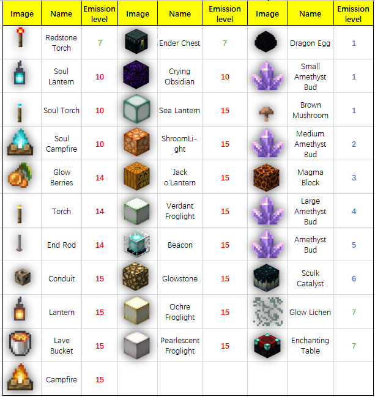

<code><a href="https://github.com/umarurize/U_DynamicLight"></a>&nbsp;U-DynamicLight</code>


 
[](LICENSE)

***

### ✨ Introductions
* **Support with 40+ glowing items**
* **Support with offhand mode**
* **Free of tedious file editing**
* **Support with full GUI forms**
* **Support with hot reloading**
* **Support with localized multi-language**
* **No damage to data**: since dynamic light implemented through network packets delivery, it will not do any damage to your Bedrock level.

***

### 📦 Installation
<details>
<summary>Check your Endstone's version</summary>

* **Endstone 0.10.0+**
  * 251221 (Bedrock Edition 1.21.111+)
  * 250813
* **Endstone 0.9.0 - Endstone 0.9.4**
  * 250619
* **Endstone 0.7.2 - Endstone 0.8.2**
  * 250415
  * 250414
    
</details>

<details>
<summary>Check pre-plugins</summary>

* **Optional pre-plugin**
  * [ZX_UI](https://www.minebbs.com/resources/zx-ui.9830/)

</details>

1. Ensure you have downloaded the correct version and installed all required pre-plugins
2. Place the `.whl` file into your server's `plugins` folder
3. Restart your server
4. Commands
   1. Enter the command `/ud` to call out the main form of U-DynamicLight
   2. Enter the command `/offhand` to switch glowing items which are allowed by the server to offhand.

**Tips**: *If a player has glowing items in both their mainhand and offhand, the light level will be set to the greater of the two.* 

***

### 📄 File structure
```
plugins/
├─ u-dynamic-light/
│  ├─ config.json
│  ├─ lang/
│  │  ├─ zh_CN.json
│  │  ├─ en_US.json
```

***

### ⚙️ Configurations
`config.json`
```json5
{
    "item_type_id_allow_in_offhand": {
      "minecraft:torch": true,
      "minecraft:soul_torch": true,
      "minecraft:redstone_torch": true,
      "minecraft:copper_torch": true,
      "minecraft:lantern": true,
      "minecraft:soul_lantern": true,
      "minecraft:copper_lantern": true,
      "minecraft:exposed_copper_lantern": true,
      "minecraft:oxidized_copper_lantern": true,
      "minecraft:waxed_copper_lantern": true,
      "minecraft:waxed_exposed_copper_lantern": true,
      "minecraft:waxed_oxidized_copper_lantern": true,
      "minecraft:waxed_weathered_copper_lantern": true,
      "minecraft:weathered_copper_lantern": true,
      "minecraft:lava_bucket": true,
      "minecraft:campfire": false,
      "minecraft:soul_campfire": false,
      "minecraft:beacon": false,
      "minecraft:enchanting_table": false,
      "minecraft:glowstone": false,
      "minecraft:lit_pumpkin": false,
      "minecraft:sculk_catalyst": false,
      "minecraft:ochre_froglight": false,
      "minecraft:pearlescent_froglight": false,
      "minecraft:verdant_froglight": false,
      "minecraft:conduit": false,
      "minecraft:sea_lantern": false,
      "minecraft:sea_pickle": false,
      "minecraft:brown_mushroom": false,
      "minecraft:glow_berries": false,
      "minecraft:glow_lichen": false,
      "minecraft:small_amethyst_bud": false,
      "minecraft:medium_amethyst_bud": false,
      "minecraft:large_amethyst_bud": false,
      "minecraft:amethyst_cluster": false,
      "minecraft:magma": false,
      "minecraft:shroomlight": false,
      "minecraft:crying_obsidian": false,
      "minecraft:end_rod": false,
      "minecraft:ender_chest": false,
      "minecraft:dragon_egg": false
    },
    "refresh_tick": 1    // light refresh interval in ticks
}
```

***

### 🌎 Localized multi-language
* Currently supported localized languages for U-DynamicLight:
- [x] `zh_CN`
- [x] `en_US`
* How to add more languages to U-DynamicLight? Here we use Japanese for an example.
  * Create a file named `ja_JP.json` and place it into `lang` folder
  * Copy all key-value pairs from `en_US.json` and paste them into `ja_JP.json`
  * Refer to the English values and translate them all into Japanese, then save the file.
  * Restart your server, and you're all done!
* If you'd like your translated language to be included as one of the official languages of this plugin, feel free to shoot over a PR.

***

### 💥 Glowing items
<div style="width: 100%; text-align: left;">
  
</div>

***

### 🤝 Specially thanks
- [x] [@zimuya4153](https://github.com/zimuya4153)
- [x] [@KobeBryant114514](https://github.com/KobeBryant114514)

[](https://github.com/GlacieTeam/BinaryStream-Python)


